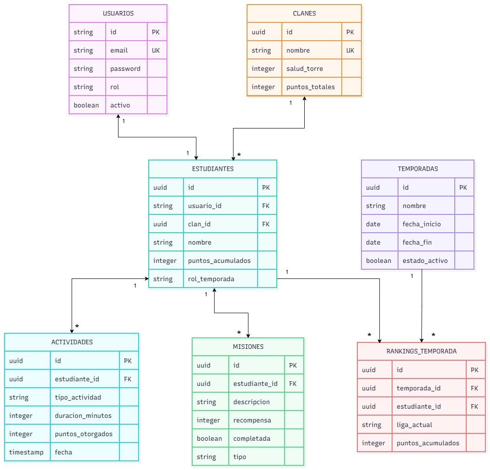

# ECIFIT Backend

Backend para la plataforma de gamificación y entrenamiento de ECI FIT.

**QA:** <!-- Julián: URL de Swagger en QA -->
**PROD:** <!-- Julián: URL de Swagger en PROD -->
**Frontend:** <!-- link al repositorio del frontend -->

## Índice
1. [Objetivo](#objetivo)
2. [Arquitectura propuesta](#arquitectura-propuesta)
3. [Estructura del proyecto](#estructura-del-proyecto)
4. [Stack tecnológico](#stack-tecnológico)
5. [Justificación de Patrones de Diseño (GoF)](#justificación-de-patrones-de-diseño-gof)
6. [Diagramas](#diagramas)
7. [Base de datos](#base-de-datos)
8. [Seguridad](#seguridad)
9. [Cómo levantar localmente](#cómo-levantar-localmente)
10. [Variables de entorno](#variables-de-entorno)
11. [Ejecución de pruebas](#ejecución-de-pruebas)
12. [CI/CD](#cicd)
13. [Despliegue](#despliegue)
14. [Integrantes](#integrantes)

## Objetivo

Proveer la capa de negocio, persistencia y exposición de APIs para gestionar:

- jugadores
- clanes
- actividades
- misiones y retos
- puntuaciones y validaciones
- eventos y notificaciones
- PostgreSQL
- Docker
- GitHub Actions
- Azure App Service

## Arquitectura propuesta

La aplicación sigue una estructura en capas con patrones de diseño GoF aplicados al núcleo de evaluación y reglas del sistema.

## Estructura del proyecto

```text
ecifit-backend/
├── src/
│   ├── main/
│   │   ├── java/
│   │   │   └── co/edu/eci/dosw/ecifit/
│   │   │       ├── EciFitApplication.java
│   │   │       ├── config/
│   │   │       ├── controller/
│   │   │       │   └── docs/
│   │   │       ├── dto/
│   │   │       │   ├── request/
│   │   │       │   └── response/
│   │   │       ├── exception/
│   │   │       ├── mapper/
│   │   │       ├── model/
│   │   │       │   ├── factory/
│   │   │       │   ├── observer/
│   │   │       │   ├── state/
│   │   │       │   └── strategy/
│   │   │       ├── persistence/
│   │   │       ├── repository/
│   │   │       ├── security/
│   │   │       ├── service/
│   │   │       └── validator/
│   │   └── resources/
│   │       └── application.properties
│   └── test/
│       ├── java/
│       │   └── co/edu/eci/dosw/ecifit/
│       │       ├── EciFitTest.java
│       │       ├── controller/
│       │       ├── exception/
│       │       ├── model/
│       │       ├── security/
│       │       ├── service/
│       │       └── validator/
│       └── resources/
│           └── application.properties
├── .gitignore
├── docker-compose.yml
├── pom.xml
└── README.md
```

## Stack tecnológico

- Java 21
- Spring Boot 3
- Spring Web
- Spring Data JPA
- Spring Validation
- Spring Security
- OpenAPI/Swagger

## Justificación de Patrones de Diseño (GoF)

El núcleo de **ECI FIT** aplica principios de *Clean Architecture* apoyados en 5 patrones de diseño fundamentales para garantizar alta cohesión, bajo acoplamiento y cumplimiento del principio Open/Closed (SOLID).

### 1. Strategy (Patrón de Comportamiento)
* **Problema:** El cálculo de experiencia y puntos varía drásticamente según el rol del estudiante (Tanque, Corredor, Estratega). Anidar condicionales (`switch`/`if-else`) en el servicio central vuelve el código rígido y propenso a errores ante la eventual creación de nuevos roles.
* **Implementación:** Encapsulamos los algoritmos de cálculo en clases independientes (ej. `TankScoreStrategy`, `RunnerScoreStrategy`) bajo una interfaz común. El motor de puntuación inyecta dinámicamente la estrategia requerida, permitiendo escalar los roles sin modificar ni recompilar la lógica core.
* **Ubicación:** `co.edu.eci.dosw.ecifit.model.strategy`

### 2. Observer (Patrón de Comportamiento)
* **Problema:** Registrar un entrenamiento dispara múltiples efectos secundarios: actualizar el daño en la torre enemiga, evaluar ascensos de división y emitir notificaciones en tiempo real al cliente. Ejecutar esto sincrónicamente degrada el tiempo de respuesta HTTP y acopla módulos independientes.
* **Implementación:** Implementamos un modelo Publicador-Suscriptor. El servicio principal emite un evento inmutable de dominio (`ActivityLoggedEvent`). Múltiples *Listeners* reaccionan de forma asíncrona y aislada para actualizar clanes o notificar vía WebSockets, respetando el Principio de Responsabilidad Única.
* **Ubicación:** `co.edu.eci.dosw.ecifit.model.observer`

### 3. State (Patrón de Comportamiento)
* **Problema:** Las reglas de negocio cambian radicalmente según el calendario académico (ej. en "Semana de Parciales" se congela el daño a la torre). Controlar esto con banderas booleanas (`if(isMidterms)`) dispersas por todo el sistema genera código espagueti.
* **Implementación:** El contexto del juego delega su comportamiento a objetos de Estado (`RegularWeekState`, `MidtermsWeekState`). Las reglas restrictivas de los parciales quedan confinadas en su propia clase, haciendo las transiciones de ciclo de vida predecibles, atómicas y fáciles de probar (Unit Testing).
* **Ubicación:** `co.edu.eci.dosw.ecifit.model.state`

### 4. Abstract Factory (Patrón Creacional)
* **Problema:** La asignación de Misiones Individuales y Retos de Clan debe ser coherente con el rol del jugador (un Tanque no debe recibir misiones exclusivas de agilidad). Instanciar estos objetos directamente con `new` acopla la creación a la lógica de negocio.
* **Implementación:** Definimos fábricas concretas por rol (ej. `TankQuestFactory`). El planificador (Cron) solicita la familia completa de misiones a la fábrica abstracta, garantizando que el jugador reciba siempre un combo Misión-Reto 100% temático y compatible, aislando la complejidad de instanciación.
* **Ubicación:** `co.edu.eci.dosw.ecifit.model.factory`

### 5. Chain of Responsibility (Patrón de Comportamiento)
* **Problema:** El sistema requiere un motor *Anti-Cheat* robusto para los registros de actividad. Validar integridad de datos, límites físicos humanos (ej. velocidad/distancia irreales) y estado de penalización en un solo bloque de código dificulta su mantenimiento.
* **Implementación:** Construimos un *Pipeline de Validación*. La petición de actividad atraviesa una cadena de eslabones independientes (`DataIntegrityHandler` -> `AntiCheatHandler` -> `BanStatusHandler`). Esto permite inyectar nuevas reglas antifraude a futuro sin alterar los validadores existentes.

### Resumen de patrones

| Patrón | Problema que resuelve | Clases | Diagrama |
|---|---|---|---|
| Strategy | El cálculo de puntos varía según el rol del estudiante. Evita condicionales anidados al agregar nuevos roles. | `RolTemporada`, `Tanque`, `Corredor`, `Estratega` | Diagrama de clases |
| Observer | Registrar una actividad dispara varios efectos (ligas y torre del clan) sin acoplar los módulos. | `ActividadObserver`, `GestorLigas`, `TorreClan` | Diagrama de clases |
| State | Las reglas cambian según el calendario académico (semana regular o de parciales). | `EstadoTemporada`, `SemanaRegular`, `SemanaParciales` | Diagrama de clases |
| Abstract Factory | La creación de misiones no debe acoplarse a la lógica de negocio. | `FabricaMisiones`, `FabricaMisionesEstandar`, `Mision`, `MisionDiaria`, `MisionSemanal` | Diagrama de clases |
| Chain of Responsibility | Validar integridad, anti-cheat y penalizaciones de una actividad sin concentrar todo en un solo bloque. | <!-- Daniel V: clases cuando se implemente --> | Diagrama de clases |

## Diagramas
### 1. Diagrama de clases


### 1.1 Justificación de Clases, Interfaces y Clases Abstractas

**Estudiante, Actividad, Clan, Temporada (Clases Concretas / Entidades de Dominio):** Entidades core del sistema con identidad propia, estado mutable y métodos de negocio que encapsulan las invariantes del dominio (control de capacidad de clanes, validación anti-cheat, rachas de constancia y ciclo de vida de la torre) sin dependencias de frameworks ni infraestructura (Clean Architecture).

**Mision (Clase Abstracta):** Modela la plantilla base de los retos del sistema. No se puede instanciar directamente porque toda misión debe poseer una periodicidad definida; encapsula atributos compartidos (id, descripcion, recompensa, completada, estudianteId) y delega obligatoriamente la regla de negocio a sus subtipos mediante el método polimórfico `verificarCumplimiento(a: Actividad)`.

**MisionDiaria y MisionSemanal (Clases Concretas):** Especializaciones de Mision que implementan las reglas particulares de validación temporal y acumulación de esfuerzo (metas de sesión única frente a minutos acumulados semanales).

**FabricaMisiones (Interfaz):** Contrato creacional del patrón **Abstract Factory**. Desacopla la creación de familias completas de misiones (diarias y semanales) del cliente que las solicita, garantizando coherencia en la asignación de retos y facilitando la incorporación de nuevas familias temáticas sin modificar el código consumidor (Principio Open/Closed).

**FabricaMisionesEstandar (Clase Concreta):** Implementación concreta de `FabricaMisiones` que encapsula la lógica de instanciación, asignación de metas y parametrización de recompensas para `MisionDiaria` y `MisionSemanal`.

**RolTemporada (Interfaz):** Contrato de comportamiento del patrón **Strategy**. Desacopla el algoritmo de cálculo de experiencia y puntuación de la entidad Estudiante, permitiendo intercambiar o extender dinámicamente las fórmulas de compensación sin alterar la lógica core del jugador (Principio Open/Closed - OCP).

**Tanque, Corredor, Estratega (Clases Concretas):** Estrategias concretas que implementan `RolTemporada`, aplicando ponderaciones diferenciadas sobre el esfuerzo físico (Fuerza × 1.5, Cardio × 1.4, Balance × 1.3) para recompensar la especialización deportiva del estudiante.

**EstadoTemporada (Interfaz):** Contrato de comportamiento del patrón **State**. Encapsula las variaciones de las reglas del juego según el calendario académico, permitiendo al objeto Temporada alterar dinámicamente la validez de los ataques y sus multiplicadores sin utilizar condicionales anidados (if-else/switch).

**SemanaRegular y SemanaParciales (Clases Concretas):** Estados concretos del ciclo semestral. `SemanaRegular` autoriza el daño entre torres y mantiene multiplicadores estándar; `SemanaParciales` bloquea los ataques a estructuras para proteger a los estudiantes en época de exámenes y aplica una bonificación compensatoria (× 1.5) por actividad deportiva registrada.

**ActividadObserver (Interfaz):** Contrato del patrón **Observer**. Desacopla a la entidad Actividad (sujeto observable) de los efectos colaterales de negocio posteriores a un entrenamiento válido, respetando el Principio de Responsabilidad Única (SRP).

**GestorLigas y TorreClan (Clases Concretas):** Suscriptores concretos que implementan `ActividadObserver`. `GestorLigas` reacciona actualizando el ranking global y evaluando ascensos o descensos de categoría; `TorreClan` calcula el impacto del entrenamiento sobre la estructura del clan rival, restando salud a la torre y evaluando su condición de destrucción.

**NivelLiga (Enumeración):** Estructura inmutable con tipado fuerte que confina las divisiones competitivas (BRONCE, PLATA, ORO, DIAMANTE), eliminando cadenas mágicas (magic strings) y asegurando integridad en las transiciones de categoría del `GestorLigas`.


### 2. Diagrama de componentes general


### 2.1 Justificación de Componentes

- **ECI FIT Frontend (Contenedor SPA):** Aplicación cliente (React, Vite, TailwindCSS) desplegada de forma autónoma. Captura eventos y renderiza la interfaz gamificada sin almacenar lógica crítica de negocio.
- **ECI FIT Backend (Contenedor API REST):** Servicio core (Spring Boot 3, Java 21). Centraliza las reglas de negocio, cómputo de puntos, patrones GoF, control de fraude y seguridad transaccional.
- **Data Base (Contenedor de Almacenamiento):** Motor de base de datos relacional (PostgreSQL) o persistencia en memoria. Mantiene la durabilidad de los datos independiente del ciclo de vida de los servicios backend.

### 3. Diagrama de componentes especifico


### 3.1 Justificación de Componentes por Fila
Cada fila representa un flujo completo e independiente de una funcionalidad (Activity, Student, Clan, Mission, Season) compuesto por:

- **Controller:** Componente de entrada web REST. Recibe la petición HTTP, aplica validación sintáctica (`@Valid`) sobre el RequestDTO y retorna el código de respuesta correspondiente (200, 201, 400, etc.) sin procesar lógica de negocio.
- **Mapper (Mapper IN):** Componente de presentación implementado con MapStruct. Transforma RequestDTO a Dominio Puro y Dominio Puro a ResponseDTO, evitando que el controlador exponga o conozca entidades internas.
- **Service:** Componente de lógica de aplicación / casos de uso. Opera exclusivamente con entidades de dominio; no recibe DTOs ni entidades de base de datos.
- **Validator:** Componente perpendicular de reglas de negocio (`@Component`). Valida restricciones complejas (ej. anti-cheat, límite de 5 miembros en clan) de forma aislada para cumplir el Principio de Responsabilidad Única (SRP) y lanza excepciones tipadas (409, 422).
- **Mapper (Mapper OUT):** Componente de persistencia. Traduce objetos del Dominio Puro a Entity (JPA) o Document (Mongo) antes de persistir, y viceversa. Aísla la base de datos del núcleo de la aplicación.
- **Repository:** Componente de acceso a datos que extiende JpaRepository o MongoRepository para ejecutar transacciones en el motor de base de datos.
- **DB:** Recurso de almacenamiento persistente centralizado donde convergen todos los repositorios.

## Base de datos


### Decisión de persistencia
Se usa PostgreSQL por su cumplimiento del estándar ACID, necesario para mantener la consistencia en el cálculo concurrente de puntos de clanes y daño a las torres. Además, garantiza integridad referencial mediante claves foráneas y restricciones de unicidad (por ejemplo, sobre el correo institucional), y sus índices optimizan las consultas de rankings.

## Seguridad
La API usa autenticación stateless con JWT (JJWT 0.12.3). `JwtAuthFilter` valida el token en cada petición con un secreto definido en la variable de entorno `JWT_SECRET`. Los usuarios se guardan en la tabla `usuarios`, separada del dominio, con contraseñas cifradas con BCrypt.

Las credenciales inválidas devuelven 401 y el acceso con un rol sin permisos devuelve 403. Ambos casos se manejan con `CustomAuthenticationEntryPoint`, `CustomAccessDeniedHandler` y `GlobalExceptionHandler`, y responden con `ErrorResponseDTO`.

### Roles y permisos
| Módulo | Método | Endpoint                                 | Público | Roles permitidos |
|---|---|------------------------------------------|---|---|
| Autenticación | POST | `/api/v1/auth/login`                     | Sí | - |
| Documentación | GET | `/swagger-ui/**`, `/v3/api-docs/**`      | Sí | - |
| Estudiantes | POST | `/api/v1/estudiantes`                    | No | ADMINISTRADOR |
| Estudiantes | GET | `/api/v1/estudiantes/{id}`               | No | ESTUDIANTE, ENTRENADOR, ADMINISTRADOR |
| Actividades | POST | `/api/v1/actividades`                    | No | ESTUDIANTE |
| Actividades | GET | `/api/v1/agitctividades/estudiante/{id}` | No | ESTUDIANTE, ENTRENADOR, ADMINISTRADOR |
| Clanes | POST | `/api/v1/clanes`                         | No | ESTUDIANTE, ADMINISTRADOR |
| Clanes | POST | `/api/v1/clanes/{id}/unirse`             | No | ESTUDIANTE |
| Misiones | POST | `/api/v1/misiones`                       | No | ENTRENADOR, ADMINISTRADOR |
| Misiones | GET | `/api/v1/misiones/estudiante/{id}`       | No | ESTUDIANTE |
| Temporadas | POST | `/api/v1/temporadas`                     | No | ADMINISTRADOR |
| Temporadas | GET | `/api/v1/temporadas/ranking`             | No | ESTUDIANTE, ENTRENADOR, ADMINISTRADOR |

## Cómo levantar localmente
**Prerrequisitos:** Java 21, Maven y Docker.

1. Clonar el repositorio.
2. Copiar `.env.example` como `.env` y completar los valores.
3. Ejecutar `docker compose up --build -d`.
4. Abrir `http://localhost:8080/swagger-ui.html`.

## Variables de entorno
Referencia: `.env.example`.

| Variable | Descripción | Ejemplo |
|---|---|---|
| DB_URL | URL de conexión a PostgreSQL | jdbc:postgresql://localhost:5432/ecifit |
| DB_USER | Usuario de la base de datos | ecifit |
| DB_PASSWORD | Contraseña de la base de datos | ****** |
| JWT_SECRET | Clave para firmar los tokens (mínimo 44 caracteres Base64) | ****** |

## Ejecución de pruebas
Ejecutar `mvn test`. El reporte de cobertura de JaCoCo se genera en `target/site/jacoco/index.html`.

<!-- captura de mvn test y de la cobertura de JaCoCo -->

## CI/CD
- **ci-qa.yml:** push a `main`, ejecuta pruebas, construye la imagen y despliega en QA.
- **ci-prod.yml:** tag `v*.*.*`, despliega en PROD con aprobación manual.

**Secrets configurados:** `DOCKERHUB_USERNAME`, `DOCKERHUB_TOKEN`, `AZURE_CREDENTIALS`, `JWT_SECRET_QA`, `JWT_SECRET_PROD`, `DB_PASSWORD_QA`, `DB_PASSWORD_PROD`, `AZURE_WEBAPP_NAME_QA`, `AZURE_WEBAPP_NAME_PROD`

<!-- Julián: link a GitHub Actions y captura del pipeline en verde -->

## Despliegue
**Imagen Docker:** <!-- Daniel V: link a Docker Hub con tag -->

### Diagrama de despliegue
<!-- Julián: imagen del diagrama hecho en draw.io, Lucidchart o Miro -->

## Integrantes
| Nombre                             | Rol | Qué implementó                                                                                                                             |
|------------------------------------|---|--------------------------------------------------------------------------------------------------------------------------------------------|
| Sebastián Camilo Granados López    | Líder técnico | Gestión del sprint en Jira, diagrama de flujo de pantallas, integración y verificación de QA y PROD, README del backend.                   |
| Daniel Jose Villamizar Castellanos | Backend: funcionalidades y Docker | Funcionalidades pendientes, manejo global de excepciones, pruebas, Dockerización, imagen en Docker Hub, diagramas de clases y componentes. |
| Juan David Munar Chaparro          | Backend: seguridad | Autenticación JWT, roles y permisos por endpoint, pruebas de seguridad, funcionalidades pendientes, diagrama de base de datos.             |
| Julian Camilo Giral Cobos          | Backend: CI/CD y Azure | Pipelines de QA y PROD, despliegue en Azure, secrets y variables de entorno, diagrama de despliegue.                                       |
| Daniel Alfredo Barrera Aranque     | Frontend | Mascota, manual de identidad, mockups finales en Figma, README del frontend.                                                               |

